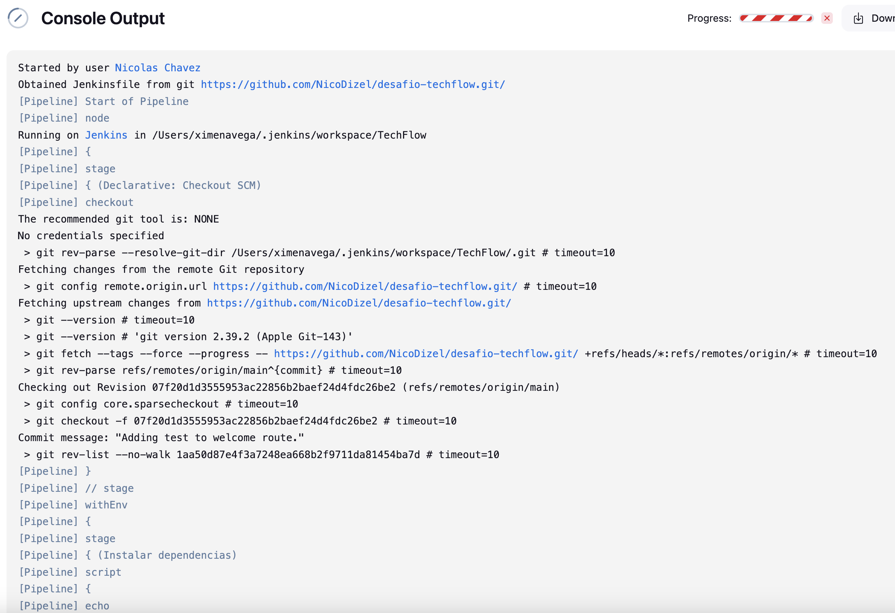
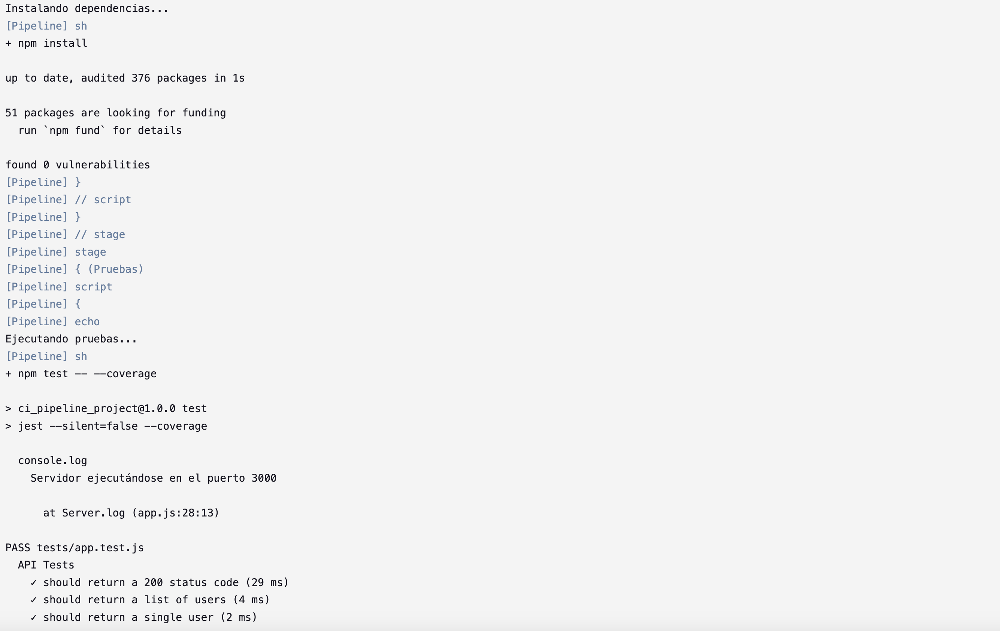
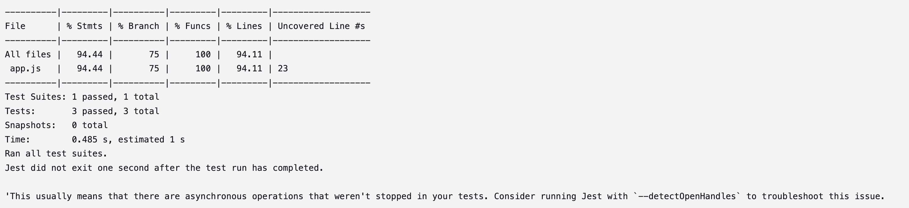
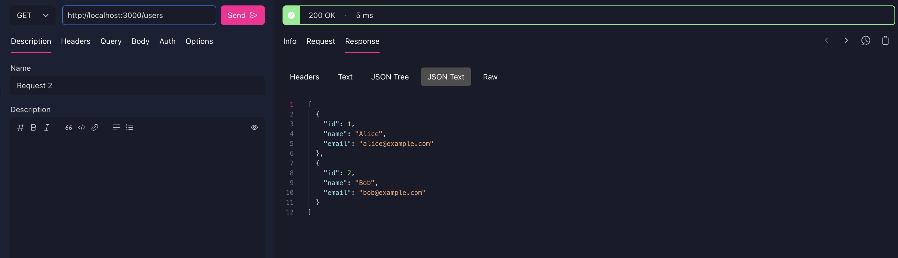
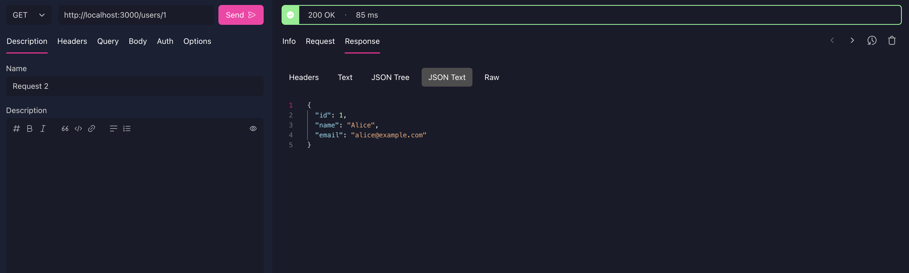
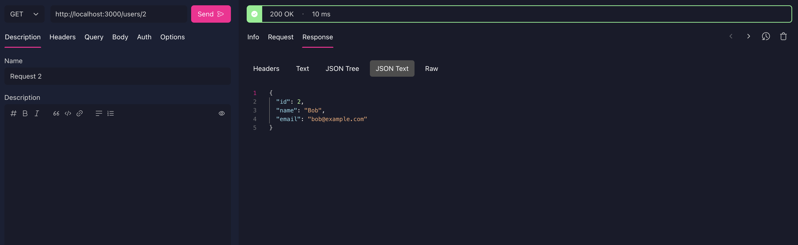

# Desafio TechFlow
Desafio del módulo 8 clase 8 del curso de DesafioLatam Backend JavaScript

Integrantes:
- Eduardo Hernández
- Nicolás Chávez

Un reporte del paso a paso se puede encontrar en REPORT.md. Además se deja evidencia de los resultados obtenidos del terminal de Jenkins y el uso de los endpoints.

### Terminal

### Endpoints

